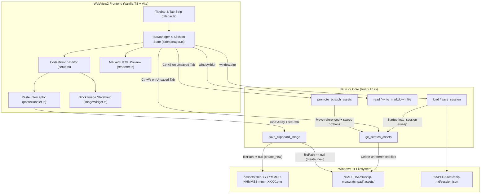
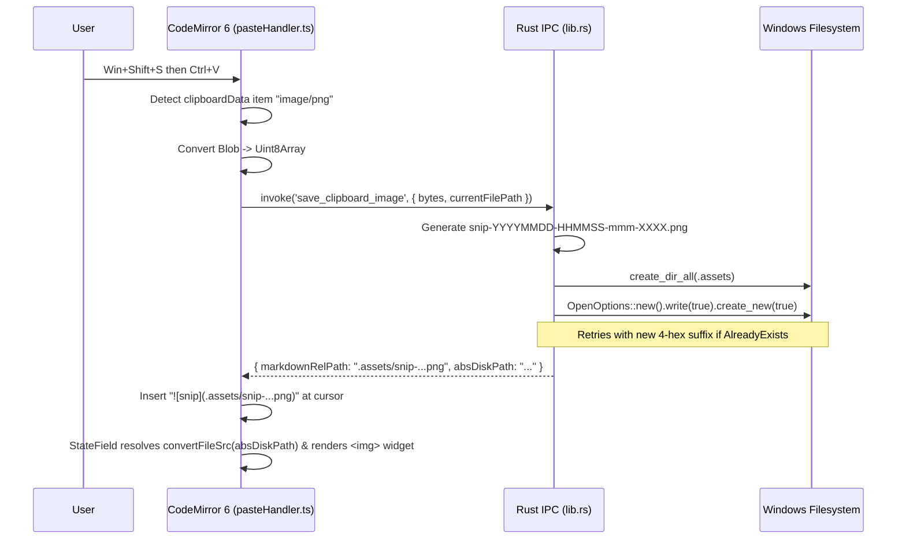
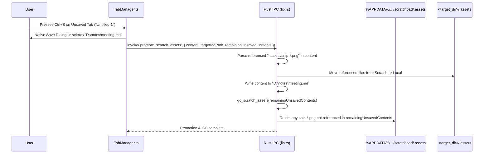

# SnipMD — Architecture & Data Flow Diagrams

## 1. High-Level Component Architecture

```mermaid
graph TD
  subgraph Frontend ["WebView2 Frontend (Vanilla TS + Vite)"]
    UI["Titlebar & Tab Strip (titlebar.ts)"]
    TM["TabManager & Session State (TabManager.ts)"]
    CM["CodeMirror 6 Editor (setup.ts)"]
    PH["Paste Interceptor (pasteHandler.ts)"]
    IW["Block Image StateField (imageWidget.ts)"]
    PR["Marked HTML Preview (renderer.ts)"]
  end

  subgraph Backend ["Tauri v2 Core (Rust / lib.rs)"]
    IPC_IMG["save_clipboard_image"]
    IPC_PROM["promote_scratch_assets"]
    IPC_GC["gc_scratch_assets"]
    IPC_FS["read / write_markdown_file"]
    IPC_SES["load / save_session"]
  end

  subgraph Disk ["Windows 11 Filesystem"]
    LOCAL["<md_dir>/.assets/snip-YYYYMMDD-HHMMSS-mmm-XXXX.png"]
    SCRATCH["%APPDATA%/snip-md/scratchpad/.assets/"]
    SESSION["%APPDATA%/snip-md/session.json"]
  end

  UI --> TM
  TM --> CM
  TM --> PR
  CM --> PH
  CM --> IW
  PH -- "Uint8Array + filePath" --> IPC_IMG
  IPC_IMG -- "filePath != null (create_new)" --> LOCAL
  IPC_IMG -- "filePath == null (create_new)" --> SCRATCH
  TM -- "Ctrl+S on Unsaved Tab" --> IPC_PROM
  IPC_PROM -- "Move referenced + sweep orphans" --> IPC_GC
  TM -- "Ctrl+W on Unsaved Tab" --> IPC_GC
  IPC_SES -- "Startup load_session sweep" --> IPC_GC
  IPC_GC -- "Delete unreferenced files" --> SCRATCH
  TM -- "window.blur" --> IPC_FS
  TM -- "window.blur" --> IPC_SES
  IPC_SES --> SESSION
```

## 2. Snipping Tool Paste & Atomic Write Flow

```mermaid
sequenceDiagram
  participant User
  participant CM6 as CodeMirror 6 (pasteHandler.ts)
  participant Rust as Rust IPC (lib.rs)
  participant FS as Windows Filesystem

  User->>CM6: Win+Shift+S then Ctrl+V
  CM6->>CM6: Detect clipboardData item "image/png"
  CM6->>CM6: Convert Blob -> Uint8Array
  CM6->>Rust: invoke('save_clipboard_image', { bytes, currentFilePath })
  Rust->>Rust: Generate snip-YYYYMMDD-HHMMSS-mmm-XXXX.png
  Rust->>FS: create_dir_all(.assets)
  Rust->>FS: OpenOptions::new().write(true).create_new(true)
  Note over Rust,FS: Retries with new 4-hex suffix if AlreadyExists
  Rust-->>CM6: { markdownRelPath: ".assets/snip-...png", absDiskPath: "..." }
  CM6->>CM6: Insert "![snip](.assets/snip-...png)" at cursor
  CM6->>CM6: StateField resolves convertFileSrc(absDiskPath) & renders <img> widget
```

## 3. Scratchpad Promotion & Orphan Garbage Collection Flow

```mermaid
sequenceDiagram
  participant User
  participant TM as TabManager.ts
  participant Rust as Rust IPC (lib.rs)
  participant Scratch as %APPDATA%/.../scratchpad/.assets
  participant Local as <target_dir>/.assets

  User->>TM: Presses Ctrl+S on Unsaved Tab ("Untitled-1")
  TM->>User: Native Save Dialog -> selects "D:\notes\meeting.md"
  TM->>Rust: invoke('promote_scratch_assets', { content, targetMdPath, remainingUnsavedContents })
  Rust->>Rust: Parse referenced ".assets/snip-*.png" in content
  Rust->>Local: Move referenced files from Scratch -> Local
  Rust->>Rust: Write content to "D:\notes\meeting.md"
  Rust->>Rust: gc_scratch_assets(remainingUnsavedContents)
  Rust->>Scratch: Delete any snip-*.png not referenced in remainingUnsavedContents
  Rust-->>TM: Promotion & GC complete
```
